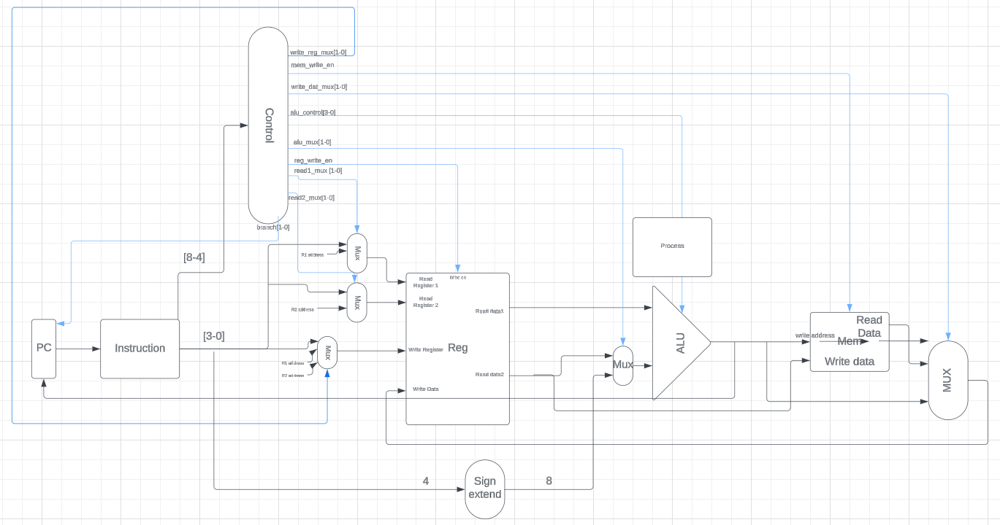

# Computer Architecture Project Overview
 

## Broad Design Ideas
&nbsp;&nbsp;&nbsp;&nbsp; Our architecture will be a single cycle implementation. This means that every instruction will only take up one clock cycle. The ISA will also follow the data memory load/store principle which means that there are only two instructions that can access data memory. No other instruction can access data memory so an ADD instruction can not add two numbers then immediately store the result into data memory. The goal of this ISA is to minimize the number of different instructions so that machine code instructions will use less bits to specify what operations will be performed. This will allow instructions to have more bits reserved for specifying the operation registers and values. Making the ISA single cycle should also simplify the hardware design making it more intuitive.
 

## Design Specifications
- 9-bit instrctions
- 14 different instructions
- 15 register allocations
  - 13 general purpose registers
  - 2 reserved registers for other operations
- 256 data memory allocations

## Control Flow Design
&nbsp;&nbsp;&nbsp;&nbsp; We are going to do both relative branching and absolute branching. For relative branching this means we need to know both the branch amount and current program counter to determine the true memory_adress location. The jump amount will be 8 bit 2’s complement. This means we can branch up to about ±127 instructions away from the current instruction pointed by the PC. If we need to jump more we can just call the branch more times.  
&nbsp;&nbsp;&nbsp;&nbsp; For absolute branching we only need to know the location of the exact instruction we want to branch to. The branch address will be unsigned since it seems odd to be able to access negative instruction addresses. The main issue with this method is that it is limited to the address that it can branch to. We have 2 absolute branch instructions that allow us to access instruction addresses 0 to 508.

## Memory Addrssing Modes
&nbsp;&nbsp;&nbsp;&nbsp;  We will support indirect absolute addressing for load/store instructions and indirect relative addressing for branching. The exact address will not be specified in the load/store instruction itself. Instead the memory address needs to be stored into register R1 beforehand. Then the load/store instruction will go to that memory address. These addresses will not be relative addresses but rather absolute addresses. This means that The memory address stored at R1 needs to be the exact memory address and should not be a value that needs to be added to a different instruction memory address. For example assume R1 = 0b0001_0004. Now perform the instruction LDR R7 which is the load from data memory instruction. Now R7 holds whatever byte value was stored at data memory location 0b0001_0004. For branching a signed 2’s complement number needs to be stored into R1. The number will increment or decrement the current program counter.

## Architecture Block Diagram

 

## Instruction List
| NAME | BIT BREAKDOWN | EXAMPLE | NOTES |
| :---- | :---- | :---- | :---- |
| MR1 | 4 bit opcode 0000,   1 bit \=  0 is register and 1 is immediate   4 bit \= what we want to store into R1 (whether it represent register or immediate depends on the 1 bit mentioned above) | MR1 \#3   // after MR1 instruction, R1 now holds 0b’0000\_0011 | This operation is moving immediate or register address into R1 |
| MR2 | 4 bit opcode 0001,   1 bit \=  0 is register and 1 is immediate   4 bit \= what we want to store into R2 (whether it represent register or immediate depends on the 1 bit mentioned above) | MR2 \#32   // after MR1 instruction, R2 now holds 0b’0010\_0000 | This operation is moving immediate or register address into R2 |
| MOV | 4 bit opcode 0010,   1 bit \= filler bit does nothing   4 bit \= register we want to move the contents of R1 to (R1 \=\> specified register) | // assume R1 has 0b0001\_0001   MOV R8   // now R8 have the 0b0001\_0001 | MOV data in R1 to destination |
| LSR= logical shift right | 4 bit opcode 0011   1 bit \= filler bit (does nothing)   4 bit \= destination register | // Assume R1 has 0b0001\_0001   // Assume R2 has 0b0000\_0010 ROR R5   // After ROR instruction R5 now holds 0b0000\_0100 | Will shift bits to the right.  Need to store value we want to rotate into R1 beforehand Need to store how much we want to rotate into R2 beforehand |
| LSL= logical shift left | 4 bit opcode 0100   1 bit \= filler bit (does nothing)   4 bit \= destination register | // Assume R1 has 0b0001\_0001   // Assume R2 has 0b0000\_0010 ROR R5   // After ROR instruction R5 now holds 0b0100\_0100 | Will shift bits to the right.  Need to store value we want to rotate into R1 beforehand Need to store how much we want to rotate into R2 beforehand |
| ADD \= mathematical add | 4 bit opcode  0101   1 bit filler bit   4 bits destination register  | // R1 has 0b0001\_0001   R2 has 0b0011\_0001   ADD R2,R1   ADD R3   // R3 has 0b0100\_0010 | Data in R1 \+ Data in R2 store into Destination register |
| EOR \= logical  xor | 4 bit opcode 0110   1 bit filler bit   4 bits destination register | // R1 has 0b0001\_0001   R2 has 0b0011\_0001   EOR R7   // R7 has 0b0010\_0000 | Bitwise exclusive OR R1 and R2 and store in destination register Need to store operand values into R1 and R2 beforehand |
| AND \=  logical and | 4 bit opcode 0111   1 bit filler bit   4 bits destination register | // R1 has 0b0001\_0001   R2 has 0b0011\_0001   AND R7   // R7 has 0b0001\_0001 | Performs bitwise AND on the values stored in R1 and R2 Need to store operand values into R1 and R2 beforehand |
| OOR \= logical or | 4 bit opcode 1000   1 bit filler   4 bits destination register | // R1 has 0b0001\_0001   R2 has 0b0011\_0001   OOR R7   // R7 has 0b0011\_0001 | OR R1 and R2 and str in destination register Need to store operand values into R1 and R2 beforehand |
| LDR \= load from data memory into register | 4 bit opcode 1001   1 bit filler   4 bit destination register | // Assume R1 \= MEM\[2\]   // Assume MEM\[2\] \= 0b0000\_0100   LDR R7   // now R7 hold 0b0000\_0100 | load from data memory from data memory location specified by R1 into destination register Need to put memory address into R1 |
| STR \= store register data into data memory | 4 bit opcode 1010   1 bit filler   4 bit operand register | // Assume R7 hold 0b0000\_0100   // Assume R1 \= MEM\[2\]   STR R7   // Now MEM\[2\] \= 0b0000\_0100 | Store data of operand register into data memory location specified by R1 Need to put memory address into R1 |
| BNE \= branch not equal | 4 bit opcode 1011   filler bit is 0   4 bit operand register | // Assume R7 hold 0b0000\_0004   // Assume R1 holds 1   // Assume current PC is 0x0000\_000C   BNE R7   // now program counter points to instruction at 0x0000\_0010  | If two values are not equal then branch to address located by the 4 bit operand register. To check if two values are not equal check the not equal flag at R1 Need to set not equal flag before hand be performing necessary equality operations |
| JMP | 4 bit opcode 1011   filler bit is 1   4 bit operand register | // Assume R7 hold 04   // Assume R1 holds 1   // Assume current PC is 0x0000\_000C   JMP R7   // now program counter points to instruction at 0x0000\_0004 | if two values are not equal then branch to address located by the 4 bit operand register. To check if two values are not equal check the not equal flag at R1 Need to set not equal flag before hand be performing necessary equality operations Can branch from 0 to 254 since registers are 8 bits and can specify max of 254 |
| BJP | 4 bit opcode 1100   filler bit is 0   4 bit operand register | // Assume R7 hold 04   // Assume R1 holds 1   // Assume current PC is 0x0000\_000C   BJP R7   // now program counter points to instruction 259 | Does a similar absolute branching to JMP. The difference is that it has an offset of 255 that is added so that absolute branching can access instruction addresses 255 to 508 |

## ISA in Example: Partial Assembly Code of Hamming Encoder
// index for getting data-mem[0] to data-mem[29]  
MOV R13 #0  
// index for getting data-mem[30] to data-mem[59]  
LDR R14 R15  

// loading from data_mem[0] and data_mem[1] and so on  
LDR R3 R13  
ADD R13 R13 #1  
LDR R4 R13  
ADD R13 R13 #1  

// parity bit 8 will be in r9  
LSR R9 R4 #2     // bit 11  
LSR R10 R4 #1   // bit 10  
EOR R9 R9 R10  
MOV R10 R4       // bit 9  
EOR R9 R9 R10  
LSR R10 R3 #7   // bit 8  
EOR R9 R9 R10  
LSR R10 R3 #6   // bit 7  
EOR R9 R9 R10  
LSR R10 R3 #5   // bit 6  
EOR R9 R9 R10  
LSR R10 R3 #4   // bit 5  
EOR R9 R9 R10  
AND R9 R9 #1    // least sig bit is where the xor of all the previous bits is located  
